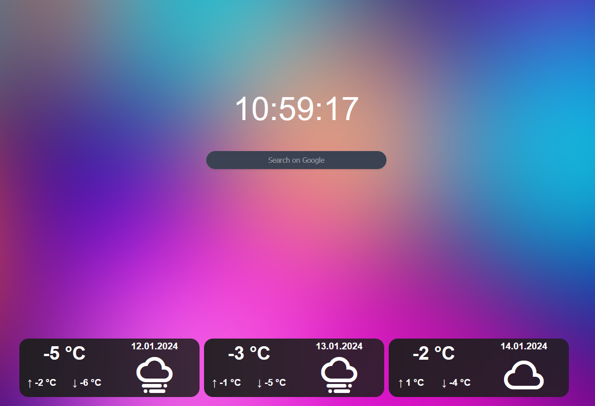

# HorizonStart

HorizonStart is a dynamic and interactive homepage project. It's designed to provide a sleek user experience with a variety of features.

## Features Implemented

- **Clock**: A real-time clock displaying the current time.
- **Search**: A search bar that allows users to perform Google searches directly from the homepage.
- **Weather**: Displays the current weather forecast for the next three days based on the user's location.

## Known Bugs

- **Long loading time**: Due to the geolocation the first time loading can be a bit long, we try to fix this issue

## Planned Features

- **Weekday**: A feature to display the current day of the week.
- **Settings**: We're planning to add a settings feature that will allow users to customize the Background, Dark mode, Bookmarks, and more.
- **Typing Animation**: A cool typing animation that enhances the visual experience of the homepage.
- **Bookmarks**: A feature to add and manage bookmarks for easy access to your favorite websites.
- **Custom Background**: This feature allows users to set their own custom background images for a personalized look and feel.

## Contributing

We welcome contributions! If you find a bug or have a feature request, please open an issue. If you want to contribute to the code, feel free to fork the repository and submit a pull request.

## License

This project is licensed under the terms of the MIT license.